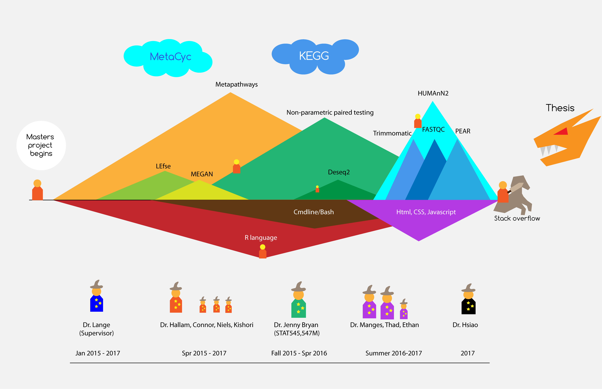

```{r setup, include=FALSE}
knitr::opts_chunk$set(echo = TRUE)
```
#### Overview  
As I am still completing my manuscript, unfortunately I won't be able to show you my code (riddled with comments) and results. Below is an overview of my data analysis journey

#### The Journey



